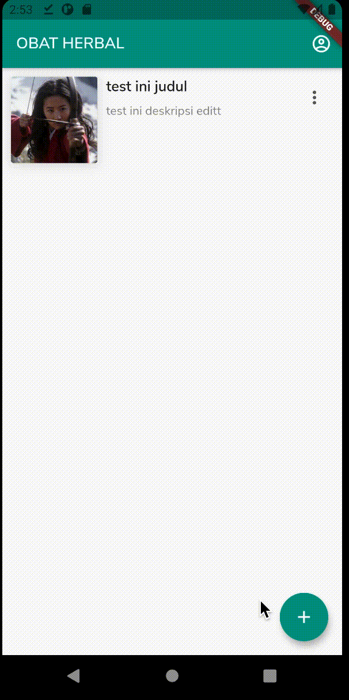
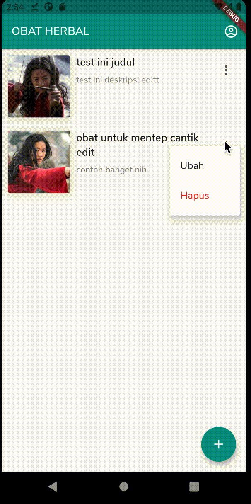

# Obat Herbal Android
Aplikasi obat herbal berbasis Android dengan **Flutter**.

## Cara memulai

Jika kamu ingin menjalankan aplikasi ini dalam komputer pribadi, silahkan simak beberapa yang harus kamu sesuaikan terlebih dahulu.

* Download dan install [Dart](https://dart.dev/get-dart).
* Download dan install [Flutter](https://flutter.dev/docs/get-started/install/windows).
* Siapkan emulator Android / Ponsel pribadi.

Jalankan project ini.
```
flutter pub get
```
```
flutter run
```

Selamat mencoba 😺.


## Demo
Halaman Beranda & Tentang.



Halaman Form tambahkan.


Halaman Form mengubah.


Melakukan aksi hapus.




## Akhir kata
Jika kamu mengalami kesulitan jangan sungkan untuk bertanya saya sangat terbuka untuk itu, btw ini disponsorin sama Mbah Wulan (Sang petarung sejati 😼).

Terima kasih.